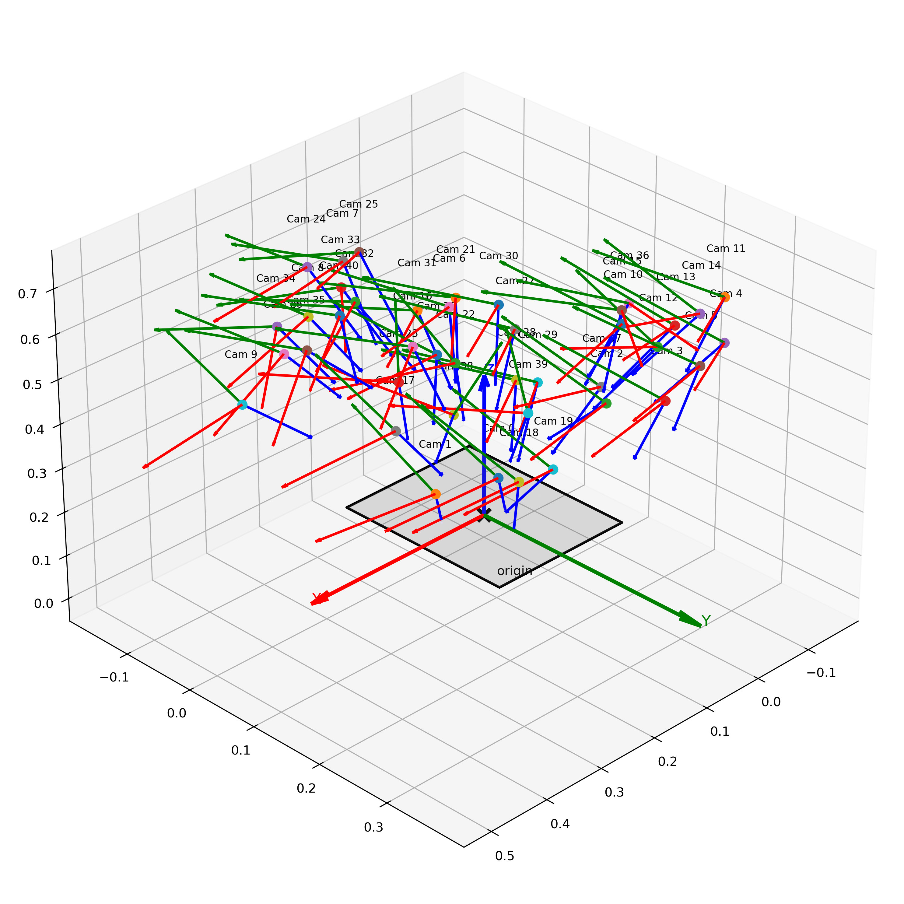

# 张正友标定实现 C++

- 本项目旨在使用Ceres对带有旋转参数进行优化学习。

- 主要是对张正友标定方法的实现C++。
- 项目中支持的优化方式
  * 使用四元数进行手动Jacobian推导，进行优化
  * 使用(简单)李代数进行推导，进行优化
  * 使用数值方法进行优化
- 支持标定后相机位姿可视化

| 库     | 版本   |
| ------ | ------ |
| OpenCV | 4.2.0  |
| Ceres  | 1.14.0 |
| Eigen  | 3.4.0  |
|        |        |

得到的结果在只优化径向畸变的情况下与OpenCV非常接近（主要是学习，OpenCV的实现细节模型可能都有差异）

> ```bash
> mkdir build && cd build
> cmake ..
> make -j(Ncore)
> 
> cd bin
> ./quat_opt # 四元数
> ./num_opt # 数值
> ./lie_opt # 李代数
> ```

下面是`3D`展示结果

```bash
usage: visualize_cam_poses.py [-h] [--board_size BOARD_SIZE] [--save SAVE] pose_file

相机位姿3D可视化工具

positional arguments:
  pose_file             相机位姿文件路径

options:
  -h, --help            show this help message and exit
  --board_size BOARD_SIZE
                        板子的尺寸
  --save SAVE

python3 visualize_cam_poses.py ../data/camera_poses_lie.txt --board_size=0.24 --save=../data/pose.png
```




## 遇到的问题

### 如何恢复尺度

根据下面的公式可以计算得到不确定的尺度因子，从而可以还原出R(使用`SVD`分解后，将左右特征矩阵相乘得到R，判断行列式的正负性)，T（一般情况下，我们建立的相机坐标系Z轴是朝着相机方向的，所以还要进行一步深度判断，也就是在进行下面操作之前，根据T的深度正负来处理尺度符号）
$$
\mathbf{s} \begin{bmatrix} \vec{\mathbf{r}}_1 & \vec{\mathbf{r}}_2 & \vec{\mathbf{t}} \end{bmatrix} = \mathbf{K}^{-1} \mathbf{H}
$$

$$
\left\{\begin{matrix}
 \mathbf{\vec{\mathbf{r}_i}}^T \mathbf{\vec{\mathbf{r}_i}} = 1 \\
 \mathbf{\vec{\mathbf{r}_i}}^T \mathbf{\vec{\mathbf{r}_j}} = 0
\end{matrix}\right.
$$

$$
\mathbf{s} = \left \| {\mathbf{K}^{-1} \mathbf{h}_1} \right \|
$$

```c++
// 对应代码为
double scale = 1 / ((cv::norm(R_t.col(0)) + cv::norm(R_t.col(1))) / 2);
if(R_t.at<double>(2, 2) < 0) { // 需要确保深度是正的，作用是保证坐标系都是统一，Z轴和镜头同向
    R_t = -R_t;
}
R_t = R_t * scale;
```

